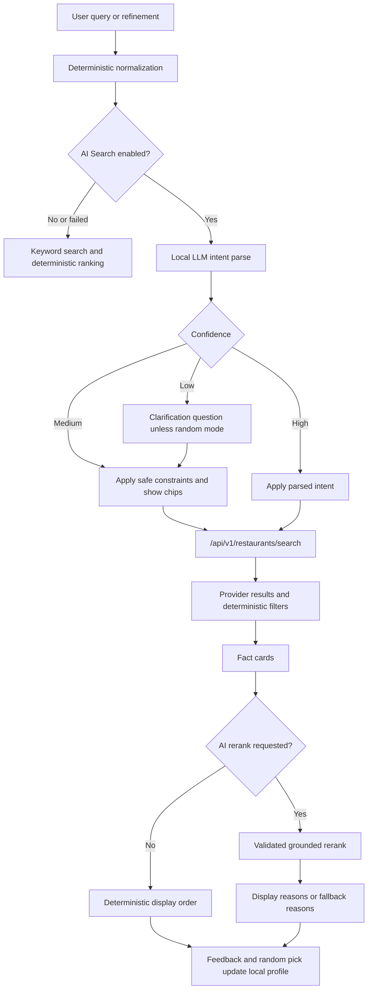

# LLM Restaurant Intelligence Design

Status: first implementation baseline, updated April 2026.

This document describes the implemented product behavior and target architecture for smarter
restaurant search, refinement, reranking, feedback, and random picks. It is written for future
implementers who need to preserve PekoPeko's local-first and no-account model while making AI
Search more useful.

## Design Goals

- Keep the app local-first and usable without AI Search.
- Use the browser-local WebLLM runtime only after the user enables AI Search.
- Keep personal taste and feedback data in localStorage. Do not send it to provider APIs or any
  remote model.
- Treat the LLM as a helper around grounded provider results, not as the recommender itself.
- Validate every LLM output shape before applying it.
- Do not allow LLM-written restaurant explanations to invent facts.
- Preserve deterministic keyword search, filters, ranking, and random pick as fallback behavior.

## Current Architecture

The implementation keeps the original local-first foundation:

- `src/lib/llm/*` contains prompts, manual JSON parsers, WebLLM hook wiring, and restaurant
  shortlist/taste-profile helpers.
- `src/app/eat-out/page.tsx` owns location-backed restaurant search, client filters, deterministic
  ranking, random mode, refinement input, and optional local AI reranking.
- `src/lib/api/restaurants.ts` powers `/api/v1/restaurants/search` and the legacy nearby route.
- Provider adapters stay server-side in `src/lib/map/*`.
- Visit and recommendation feedback are local Zustand stores in `src/stores/visited.ts` and
  `src/stores/restaurant-feedback.ts`.

The design keeps that shape: small typed modules do the new work, while page components mostly wire
state and render controls.

## End-to-End Flow



## LLM Responsibilities

The LLM may:

- Parse user intent into bounded, typed fields.
- Report confidence and missing information.
- Ask one concise clarification question.
- Expand vague queries into provider-specific search terms.
- Parse follow-up refinements into conservative patches.
- Rerank a small candidate set using provided fact cards.
- Write short explanation prose that is accepted only after grounding validation.

The LLM must not:

- Create restaurants.
- Create provider facts.
- Infer unsupported facts such as quiet, vegetarian-friendly, good for dates, English menu, open
  now, or WiFi unless the fact card supports them.
- Override deterministic hard filters with unsupported assumptions.
- Receive or use personal taste data unless AI Search is enabled locally.

## Core Types

### Intent

`EatOutSemanticIntent` should keep existing fields and add:

```ts
type MissingIntentInfo =
  | 'budget'
  | 'occasion'
  | 'distance'
  | 'cuisine'
  | 'partySize'
  | 'ambience'
  | 'openingHours'
  | 'dietary';

interface EatOutSemanticIntent {
  keyword?: string;
  category?: string;
  openNow?: boolean;
  minRating?: 3 | 3.5 | 4 | 4.5;
  maxBudgetLevel?: 1 | 2 | 3 | 4;
  partySize?: number;
  features?: EatOutFeature[];
  sortBy?: EatOutSortOption;
  confidence: number;
  missingInfo?: MissingIntentInfo[];
  clarifyingQuestion?: {
    question: string;
    options: string[];
  };
  spatialIntent?: SpatialIntent;
  queryExpansion?: EatOutQueryExpansion;
  softPreferences?: string[];
}
```

Default handling:

- Older or minimal parsed intents get `confidence = 0.7` when at least one known actionable field
  exists.
- Invalid confidence values are clamped to `0..1`.
- Unknown enum values are dropped.
- Unknown object fields are ignored in LLM parsers, matching the current parser style.

Confidence behavior:

- High confidence, `>= 0.75`: apply parsed fields normally.
- Medium confidence, `>= 0.45`: apply safe hard constraints only and show refinement chips.
- Low confidence, `< 0.45`: show a clarification question before reranking or filtering, unless
  the user asked for random, surprise, or adventure mode.

### Spatial Intent

```ts
interface SpatialIntent {
  type:
    | 'near_current_location'
    | 'near_landmark'
    | 'near_station'
    | 'along_route'
    | 'between_people';
  anchorText?: string;
  maxWalkMinutes?: number;
  radiusM?: number;
  importance: 'hard' | 'soft';
}
```

Rules:

- `near_current_location` uses existing coordinates and radius controls.
- `maxWalkMinutes` converts to `radiusM = minutes * 70`, clamped to supported search-radius bounds.
- `near_station` and `near_landmark` use `anchorText` as a query anchor. They do not geocode the
  landmark in the first version.
- `along_route` and `between_people` are parsed but treated as unsupported soft preferences with a
  user-visible refinement note.

### Query Expansion

```ts
interface EatOutQueryExpansion {
  primaryKeyword?: string;
  providerQueries?: Partial<Record<MapProviderType, string[]>>;
  hardFilters?: Array<'openNow'>;
  softPreferences?: string[];
}
```

Provider query expansion is used only when:

- the original query is vague,
- the LLM confidence is low or medium,
- the query contains ambience/workflow terms such as quiet, quick, work, station, healthy, cheap,
  group, solo, or open now,
- or the base provider search returns too few results.

Expansion bounds:

- maximum 3 query strings per provider,
- maximum 6 total expanded query strings,
- normalized non-empty strings only,
- no recursive expansion,
- provider search falls back to base keyword results if expansion fails.

### Fact Cards

The reranker receives compact normalized fact cards, not raw provider objects:

```ts
interface RestaurantFactCard {
  id: string;
  name: string;
  distanceM?: number;
  rating?: number;
  priceLevel?: 1 | 2 | 3 | 4;
  openNow?: boolean;
  cuisine?: string;
  features: string[];
  ambienceHints?: string[];
  occasionHints?: string[];
  providerConfidence: 'high' | 'medium' | 'low';
  missingFacts: string[];
  deterministicReasons: string[];
}
```

Fact derivation rules:

- `id` is the stable restaurant identity key.
- `features` come only from provider feature codes.
- `ambienceHints` and `occasionHints` are derived only from supported fields such as private room,
  non-smoking, capacity, access info, or known feature codes.
- `missingFacts` explicitly lists facts the app does not know, such as noise level or dietary
  support.
- Provider text is untrusted input and cannot change prompt instructions.

### Rerank Output

```ts
interface EatOutRerankRecommendation {
  id: string;
  score: number;
  matched: string[];
  tradeoffs: string[];
  reason: string;
  confidence: number;
}
```

Validation rules:

- Reject entries with IDs not present in candidate fact cards.
- Drop duplicate IDs after the first accepted entry.
- Clamp `score` and `confidence` to `0..1`.
- Keep `matched` and `tradeoffs` only when they map to candidate facts or deterministic reasons.
- Accept LLM prose only if the reason passes claim validation.
- If prose contains unsupported claims, replace it with a local reason composed from accepted
  evidence.
- If the entire output is invalid, keep deterministic order and show no AI rank.

### Feedback Aspects

```ts
type FeedbackAspect =
  | 'taste'
  | 'price'
  | 'distance'
  | 'ambience'
  | 'noise'
  | 'crowd'
  | 'service'
  | 'solo'
  | 'group'
  | 'dietary'
  | 'access'
  | 'opening_hours'
  | 'not_my_mood';
```

Feedback events gain `aspects?: FeedbackAspect[]`. Old persisted feedback migrates to an empty
aspect array.

Derived profile gains:

- weighted aspect scores,
- preferred aspects,
- avoided aspects,
- recently rejected aspects,
- pinned local preferences,
- hidden local preferences.

Aspect profiles stay local. Provider APIs receive only normal search inputs such as keyword,
location, radius, filters, and sort.

### Search Session Goal and Patches

```ts
interface SearchSessionGoal {
  originalQuery?: string;
  currentConstraints: Record<string, unknown>;
  softPreferences: string[];
  rejectedAspects: string[];
  acceptedRefinements: string[];
}

interface EatOutRefinementPatch {
  operation: 'refine';
  addSoftPreferences?: string[];
  removeCuisines?: string[];
  maxBudgetLevel?: 1 | 2 | 3 | 4;
  partySize?: number;
  openNow?: boolean;
  spatialIntent?: SpatialIntent;
  rerankOnly?: boolean;
}
```

Patch behavior:

- "Not ramen" removes ramen/noodles terms from the current goal and adds a rejected cuisine/aspect.
- "Open now" sets `openNow = true`.
- "For 4 people" sets `partySize = 4`.
- "Closer to the station" adds station/access preference and, when possible, spatial anchor text.
- "More like the second one but cheaper" can use the displayed candidate order as context, then
  applies a cheaper budget constraint and a rerank preference.
- Invalid patches fall back to the existing keyword refine path.

## API Design

The public v1 search contract gains provider-specific expansion support:

```yaml
RestaurantSearchQuery:
  type: object
  additionalProperties: false
  properties:
    keyword:
      type: string
    categoryId:
      type: string
    providerKeywords:
      type: object
      additionalProperties: false
      properties:
        google:
          type: array
          maxItems: 3
          items:
            type: string
        hotpepper:
          type: array
          maxItems: 3
          items:
            type: string
        amap:
          type: array
          maxItems: 3
          items:
            type: string
```

Server behavior:

- First-page v1 requests may include `providerKeywords`.
- Cursor follow-up requests remain cursor-only and cannot redefine expansion.
- Base keyword search runs first.
- Expansion runs only if base results are too few after provider merge and hard filters.
- Provider statuses remain provider-level, not query-level, to avoid public contract churn.
- Expansion failure is non-fatal when base results exist.

## UI Design

Home search:

- High-confidence intent navigates directly to Eat Out.
- Medium-confidence intent navigates with safe fields and shows refinement chips on Eat Out.
- Low-confidence intent shows one clarification question before navigation, except random/surprise.

Eat Out page:

- Keep the existing refine input.
- Add a compact clarification/refinement panel below the input.
- Show suggested chips as actions that append or apply refinements.
- Add random mode control: safe, balanced, adventure.
- Show AI rank reasons only after grounding validation.
- Add aspect chips after feedback actions.

Settings:

- Add an "AI restaurant preferences" card.
- Show inferred local preferences:
  - usually prefer,
  - avoid,
  - always consider,
  - recently rejected aspects.
- Users can pin preferred aspects, mark aspects as always-consider, or hide aspects locally.

## Random Pick Design

Random pick uses a weighted score instead of naive choice:

```text
finalScore =
  relevanceScore
  + tasteScore
  + noveltyScore
  + diversityBonus
  - recentVisitPenalty
  - negativeFeedbackPenalty
```

Modes:

- Safe: highest confidence, higher ratings, known preferences, stronger penalties.
- Balanced: relevance and novelty are weighted similarly.
- Adventure: boosts uncommon cuisines/features not previously rejected while preserving hard
  negative-feedback suppression.

The selector remains random by using weighted selection, but accepts an injectable random function
for deterministic tests.

## Fallback and Failure Behavior

- If AI Search is disabled, all new UI falls back to keyword search and deterministic ranking.
- If local model initialization fails, existing LLM runtime fallback remains in effect.
- If intent parsing fails, keep keyword search.
- If query expansion fails, keep base search results.
- If rerank output is invalid, keep deterministic order.
- If reason grounding fails, replace the reason locally or omit it.
- If feedback aspect data is absent, profile derivation behaves as it does today.

## Privacy Model

- Location and search terms already go to server-side provider proxies for restaurant search.
- Local feedback, visits, aspect preferences, and derived taste profile stay in localStorage.
- The local LLM may use the taste profile only in browser memory after AI Search is enabled.
- Provider APIs never receive local taste profiles, feedback history, or preference aspects.

## Future Work

- True landmark geocoding for `near_landmark` and `near_station`.
- Route and midpoint planning for `along_route` and `between_people`.
- Candidate-aware follow-ups such as "more like the second one" using displayed result context.
- Reusable clarification/refinement components if the same UI appears outside Home and Eat Out.
- Broader server-side provider expansion tests around mocked provider adapters.
- Live dev deployment verification for provider-backed behavior.
- More formal natural-language claim extraction for reason validation.
- Remote model support only if a separate explicit opt-in privacy model is designed.
